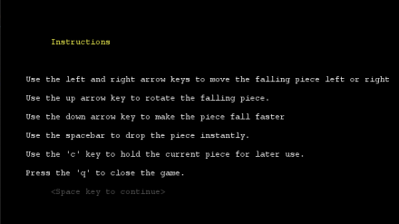
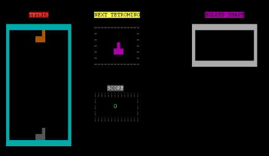
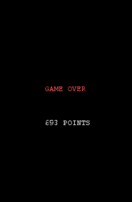

# LDTS_1104 - Tetris

## Game Description

-----
Tetris is a game where you have several different shapes called Tetriminos (Square shape, T-shape, S-shape, Z-shape, I-shape, J-shape and L-shape) which move downwards on a vertical grid.
The Tetris game requires players to strategically rotate, move, and drop a procession of Tetriminos that fall into the rectangular Matrix at increasing speeds. Players attempt to clear as many lines as possible by completing horizontal rows of blocks without empty space,
but if the Tetriminos surpass the Ceiling the game is over!

This project was developed by *Eduardo Silva* (*up202005283*@fe.up.pt), *José Araújo* (*up202007921*@fe.up.pt) and *José Ribeiro* (*up202007231*@fe.up.pt) for LDTS 2021⁄22.

For accessing the full report, click [here](./docs/README.md).


## Controls

-----
 
```←``` : Moves the the current shape to the left.  
```→``` : Moves the the current shape to the right.  
```↑``` : Rotates the shape clockwise.  
```↓``` : Moves the current shape down one block.  
```SpaceBar``` : Instant drop.   
```C``` : Holds current piece for later use. After the first use, it retrieves the piece that was on hold.  
```Q``` : Quits the game.

##Score

-----
The score of the game increases by the following rules:

- **Line clear** - 100 points;
- **Double Line clear** - 300 points;
- **Triple Line clear** - 500 points;
- **Tetris clear (4 lines)** - 800 points;
- **Soft Drop** - 1 x distance;
- **Instant Drop** - 2 x distance;
## Screenshots

-----
The following screenshots illustrate the general look of our game, as well as several of the implemented functionalities:

<p align="center" justify="center">
   
</p>
<p align="center">
  <b><i>Image 1. Main Menu</i></b>
</p>
<br>
<br />

<p align="center" justify="center">
   
</p>
<p align="center">
  <b><i>Image 2. Instructions Menu</i></b>
</p>
<br>
<br />

<p align="center" justify="center">
   
</p>
<p align="center">
  <b><i>Image 3. Game View</i></b>
</p>
<br>
<br />

<p align="center" justify="center">
   
</p>
<p align="center">
  <b><i>Image 4. Game Over</i></b>
</p>
<br>
<br />


##Game Demo

-----

<p align="center" justify="center">
   
</p>
<p align="center">
  <b><i>Gif 1. Gameplay</i></b>
</p>
<br>
<br />


