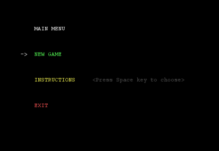
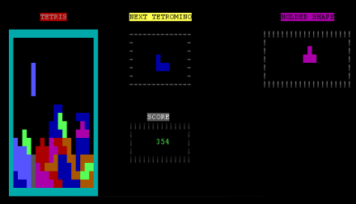
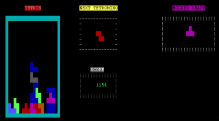
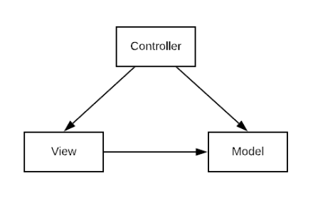
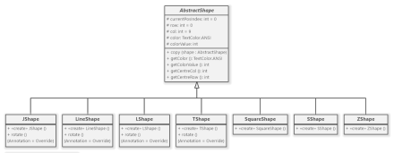
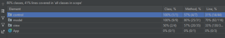
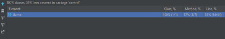
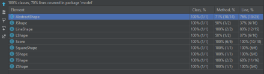
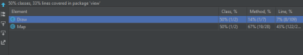

# LDTS_1104 - TETRIS


## Game Description

Tetris is a game where you have several shapes called Tetriminos (Square shape, T-shape, S-shape, Z-shape, I-shape, J-shape and L-shape) which move downwards on a vertical grid.
The Tetris game requires players to strategically rotate, move, and drop a procession of Tetriminos that fall into the rectangular Matrix at increasing speeds. Players attempt to clear as many lines as possible by completing horizontal rows of blocks without empty space,
but if the Tetriminos surpass the Ceiling the game is over!

This project was developed by *Eduardo Silva* (*up202005283*@fe.up.pt), *José Araújo* (*up202007921*@fe.up.pt) and *José Ribeiro* (*up202007231*@fe.up.pt) for LDTS 2021⁄22.

### Implemented Features

-----

- **Main Menu** - A menu at the start with new game launch option, instructions and exit.

<p align="center" justify="center">
   
</p>
<p align="center">
  <b><i>Image 1. Main Menu</i></b>
</p>
<br>
<br />

- **Move** - Using the ```←``` and ```→``` keys, the player can move the current piece to the left or right. By pressing the ```↓``` key, the player can move the current piece one block down.
- **Rotate** - Using the ```↑``` key, the player can rotate the current piece clockwise.
- **Hold** - The player can press ```C``` to hold the current piece; after that the player can press ```C``` to switch the current piece to that piece that was held.
- **Next piece** - Separate frame besides the game frame with the next piece to drop in the game's matrix
- **Instant drop** - The player can press ```SpaceBar``` to instantly drop the current piece in the matrix (in the position shown by the ghost piece).
- **Ghost piece** - The Ghost piece is the Tetrimino outline you see at the bottom of the matrix.
This Ghost piece shows you where your current piece is lined up, and how it'll fit into the matrix depending on your rotation.
- **Game's Stats** - A separate frame besides the game's frame where the current score is being updated.

- **Tetris** - When you complete 4 full lines at a time, you make a 'Tetris', getting extra points.

<br>
<br />
<p align="center" justify="center">
   
</p>
<p align="center">
  <b><i>Image 2. Before Tetris</i></b>
</p>
<br>
<br />

<p align="center" justify="center">
   
</p>
<p align="center">
  <b><i>Image 3. After Tetris</i></b>
</p>
<br>
<br />

- **Quit** - Pressing ```Q``` at anytime will close the game.


### Planned Features

-----
All the planned features were implemented successfully, except for the leaderboard, which we couldn't finish on time.


## Design

------

### MVC


**Problem in Context**

Separate the data, interface and control of the game to have a more code reusability and to make the code more organized and easy to implement. Without this pattern, the Single Principle Resposability could be broken, as a part of any of the MVC parts coulb be implemented on another.

**The Pattern**

We have applied the **MVC** pattern. The MVC pattern is a way to separate all the code in three elements, Model, View and Control. The Model does not have dependences, the View depends on the Model, and the Controller depends on both the Viewer and Model.

**Implementation**

The following figure shows three directories that represent one of the MVC elements, named ['model'](/src/main/java/model/),
['view'](/src/main/java/view/) and
['control'](/src/main/java/control/).

<p align="center" justify="center">
  
</p>
<p align="center">
  <b><i>Image 4. Model View Control </i></b>
</p>
<br>
<br />


**Consequences**

The use of the MVC Pattern in the current design allows the following benefit:

- Front-end and back-end can be done simultaneously, and related actions are grouped making the code more organized.
- High cohesion.
- The program is easy to modify and to test because the three elements are isolated from each other.

###Shape objects creation - Abstract Factory design

-----

**Problem in Context**

The `Map` class needed to create objects (different Shapes) that follow a general pattern.
The system to put this need in place consists of creating a family of objects, with different characteristics (different Shapes).

In order to add the shapes to our game, we needed a way to create individual Shapes objects that match other objects of the same family.

**The Pattern**

The pattern that we have decided to use was the Abstract Factory design pattern. We created an abstract class named [AbstractShape](/src/main/java/model/AbstractShape.java);
and one class for each shape ([JShape](/src/main/java/model/JShape.java), [LineShape](/src/main/java/model/LineShape.java), [LShape](/src/main/java/model/LShape.java),
[SquareShape](/src/main/java/model/AbstractShape.java), [SShape](/src/main/java/model/SShape.java), [TShape](/src/main/java/model/TShape.java),
[ZShape](/src/main/java/model/ZShape.java)) 
that extends the `AbstractShape` class.

**The Implementation**
<p align="center" justify="center">
  
</p>
<p align="center">
  <b><i>Abstract Factory </i></b>
</p>
<br>
<br />

**Consequences**

This pattern allows the following benefits:

- It isolates concrete classes. The Abstract Factory pattern helps us control the classes of objects that the `AbstractShape` class creates.
- It promotes consistency among products.
- This separates product construction code from the code that actually uses the product. Therefore it’s easier to extend the product construction code independently from the rest of the code.

###Singleton

-----

**Problem in Context**

The problem was..


**The Pattern**

We decided to implement the Singleton design pattern

**The Implementation**
<p align="center" justify="center">
  
</p>
<p align="center">
  <b><i>Singleton </i></b>
</p>
<br>
<br />

**Consequences**


-----


## Known code smells and refactoring suggestions

-----
###Large class

Due to the mediator design, the `Map` class is the heart of our game since it has all methods that make a change in, not only, the matrix of the game,
but also the hold shape and next shape features which appear on the side of the map's frame. As such the code inside this class is exponentially larger than in all other classes of our project.
Although this was inevitable, we paid extra attention to this class, making sure that along the way we weren't making irreversible errors.

###Not complying with MVC design pattern

We had many `Draw` methods that were out of place, namely inside the `Control` package, that belonged in the `View` package.

We solved this issue by refactoring all methods that were in charge of drawing something in the screen
that were on `Control` package, by creating a new class, [Draw](/src/main/java/view/Draw.java), inside the `View` package, that handled those methods.


## Testing

-----
###Coverage
<p align="center" justify="center">
  
</p>
<br>
<br />

###Tests for control
<p align="center" justify="center">
  
</p>
<br>
<br />

###Tests for model
<p align="center" justify="center">
  
</p>
<br>
<br />

###Tests for view
<p align="center" justify="center">
  
</p>
<br>
<br />

In some cases (Map and Draw) it was not possible to obtain a higher coverage due to the fact that some methods (for example the ones regarding the displaying of the map) weren't tested 
because they weren't, in our understanding, related to the aim of our project.


### Self-Evaluation

- Eduardo Silva: 33,(3)%
- José Araújo: 33,(3)%
- José Ribeiro: 33,(3)%
